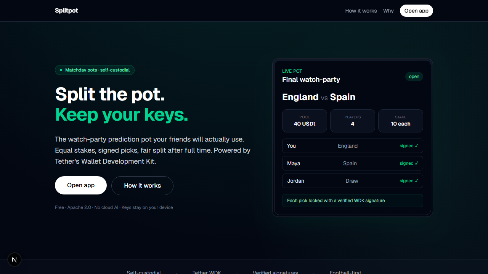
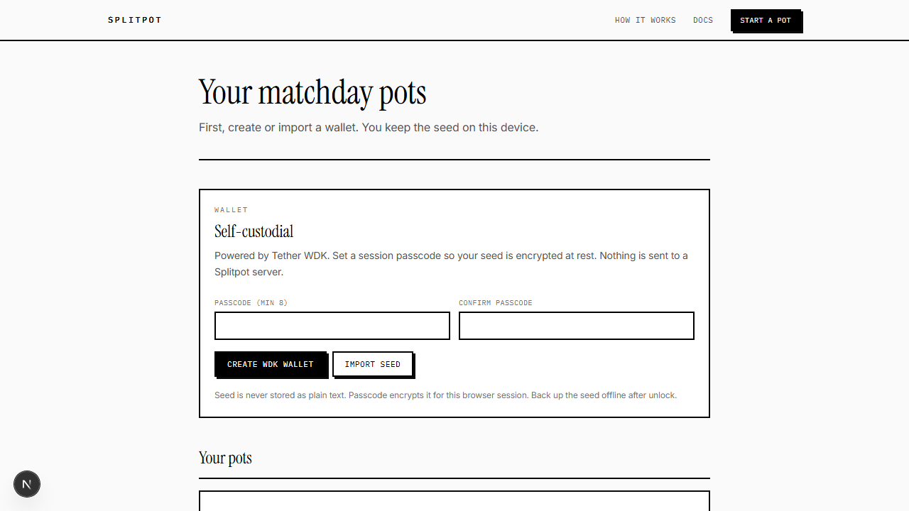
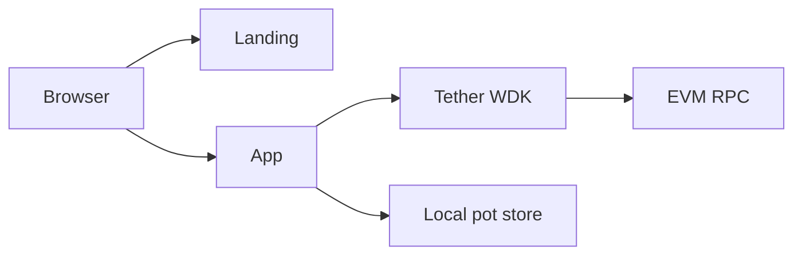

# Splitpot

Self-custodial matchday prediction pots. Equal stakes, signed picks, fair splits after full time.

[](./LICENSE)
[](https://nextjs.org/)
[](https://wdk.tether.io)
[](https://www.typescriptlang.org/)
[](https://github.com/mystiquemide/splitpot/actions/workflows/ci.yml)

## Positioning

Watch parties already run informal pots on Venmo, cash, or a trusted friend. Splitpot makes that flow honest: every player holds their own keys with **Tether WDK**, locks a pick with a real signature, and settles when the whistle goes. No custodian. No cloud AI.

## Documentation

Full product docs ship with the app:

**https://github.com/mystiquemide/splitpot** → open the deployed site at `/docs` (or local `http://localhost:3000/docs`).

| Page | Path |
|------|------|
| Introduction | `/docs` |
| Getting started | `/docs/getting-started` |
| How it works | `/docs/how-it-works` |
| Wallets & signing | `/docs/wallets` |
| On-chain USDt | `/docs/on-chain` |
| Security | `/docs/security` |
| Architecture | `/docs/architecture` |
| Deployment | `/docs/deployment` |
| FAQ | `/docs/faq` |

## Product

| Surface | Route |
|---------|--------|
| Landing | `/` |
| App (wallet + pots) | `/app` |
| Pot room | `/pot/[id]` |
| Import share link | `/import?d=…` |
| Documentation | `/docs` |

<p align="center">
  
</p>

<p align="center">
  
</p>

> Screenshots: see `docs/assets/`. If images are missing in a shallow clone, run the app locally and capture `/` and `/app`.

## Features

- **Self-custodial wallets** — create or import a seed with Tether WDK; keys stay in the browser session
- **Explicit signing** — unlock, create, join, and settle open a sign modal; no silent signatures
- **Verified attestations** — every join is checked with WDK read-only `verify`
- **Equal-stake pots** — same stake for every player, simple winner split
- **Share links** — export pot state so friends can import on another device
- **Consumer landing** — clear product story before the app

## Tech stack

| Layer | Choice |
|-------|--------|
| Framework | Next.js 16 (App Router) |
| Language | TypeScript |
| UI | React 19, Tailwind CSS 4 |
| Wallets | `@tetherto/wdk`, `@tetherto/wdk-wallet-evm` |
| Storage | `sessionStorage` (wallet), `localStorage` (pots) |
| Hosting | Vercel-ready |

## Architecture

Wallet keys and signing run on the user device. Pot records live in browser storage and can be shared via encoded links. Optional EVM RPC is used for wallet module provider config.



See [docs/ARCHITECTURE.md](./docs/ARCHITECTURE.md) for trust boundaries and the full signing sequence.

## Quick start

```bash
git clone https://github.com/mystiquemide/splitpot.git
cd splitpot
npm install
cp .env.example .env.local
npm run dev
```

Open [http://localhost:3000](http://localhost:3000).

## Environment variables

| Variable | Required | Description |
|----------|----------|-------------|
| `NEXT_PUBLIC_EVM_RPC_URL` | No | EVM JSON-RPC for WDK. Defaults to a public Sepolia endpoint. |
| `NEXT_PUBLIC_APP_URL` | No | Canonical URL for production share links. |

See [`.env.example`](./.env.example) and [docs/DEPLOYMENT.md](./docs/DEPLOYMENT.md).

## Scripts

| Command | Purpose |
|---------|---------|
| `npm run dev` | Local development |
| `npm run build` | Production build |
| `npm start` | Serve production build |
| `npm run lint` | ESLint |
| `npm run typecheck` | TypeScript `--noEmit` |

## How WDK is used

| Action | API |
|--------|-----|
| Seed | `WDK.getRandomSeedPhrase()` |
| Wallet | `WalletManagerEvm` + `SeedSignerEvm` |
| Sign | `account.sign(message)` after user confirms |
| Verify | `WalletAccountReadOnlyEvm.verify(message, signature)` |
| USDt balance | `account.getTokenBalance(token)` |
| USDt transfer | `account.transfer({ token, recipient, amount })` after user confirms |

### On-chain USDt path

1. Set `NEXT_PUBLIC_USDT_ADDRESS` (+ matching RPC) in `.env.local`
2. Create a pot with **On-chain USDt stakes** enabled
3. Joiners **sign** their pick, then **send stake** to the host via WDK ERC-20 transfer
4. Host settles the match, then **Pay USDt** to each winner (on-chain transfer)

Host acts as temporary escrow with their own self-custodial key. Explorer links are recorded on the pot.

## Try the product

1. Open `/` → **Open app**
2. Create a WDK wallet and sign the unlock challenge
3. Create a pot and sign your pick
4. Add a second player (new wallet, signed join) or share the pot link
5. Lock picks, sign to settle, review the payout plan

## Verification status

| Check | Status |
|-------|--------|
| `npm run lint` | Run in CI and before release |
| `npm run typecheck` | Run in CI and before release |
| `npm run build` | Required green |
| Product paths `/`, `/app`, pot room | Manual smoke on each release |

## Deployment

See [docs/DEPLOYMENT.md](./docs/DEPLOYMENT.md).

```bash
npx vercel link
npx vercel --prod
```

## Repository layout

```
src/
  app/                 # routes: landing, app, pot, import
  components/          # landing, wallet, sign modal, pot room
  lib/                 # WDK client, pot logic, storage
docs/
  ARCHITECTURE.md
  DEPLOYMENT.md
  assets/              # product screens
.github/               # CI, CodeQL, Dependabot, templates
```

## Contributing

See [CONTRIBUTING.md](./CONTRIBUTING.md). Pull requests are welcome.

## Security

See [SECURITY.md](./SECURITY.md). Report vulnerabilities privately to splashmediahub@gmail.com.

## License

[Apache License 2.0](./LICENSE)
