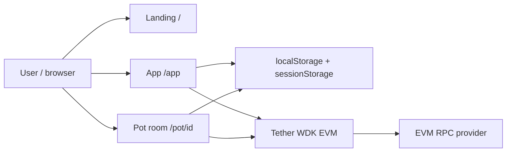
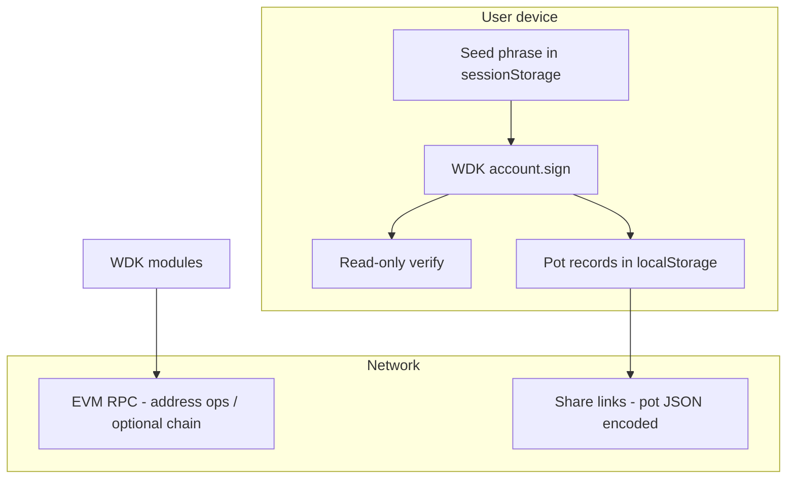
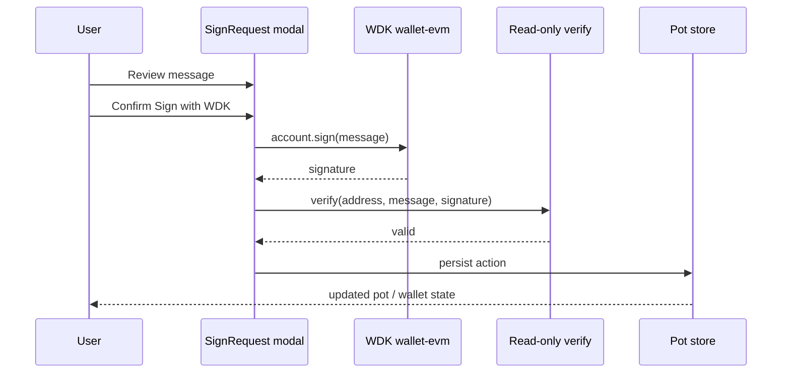

# Architecture

Splitpot is a browser-first, self-custodial matchday pot product. Wallet keys never leave the client. Pot coordination is local (browser storage + shareable encoded state). Signing uses Tether WDK on EVM.

## System overview

## Trust boundaries

## Signing flow

## Layers

| Layer | Responsibility |
|-------|----------------|
| Landing | Product positioning and entry to the app |
| App shell | Wallet unlock, pot list, create pot |
| Pot room | Join, lock, settle, payout plan |
| WDK client | Seed, address, sign, verify, optional send |
| Store | Session wallet + durable pot list |

## Design decisions

1. **Self-custody first** — seeds stay in the browser; no custodial backend.
2. **Explicit signing** — no silent signatures; users read the message first.
3. **Equal-stake pots** — simple rules people already understand from cash pots.
4. **Peer settlement** — payout plan points at winner addresses; transfers remain user-controlled.
5. **Apache 2.0** — public open source for inspection and reuse.
